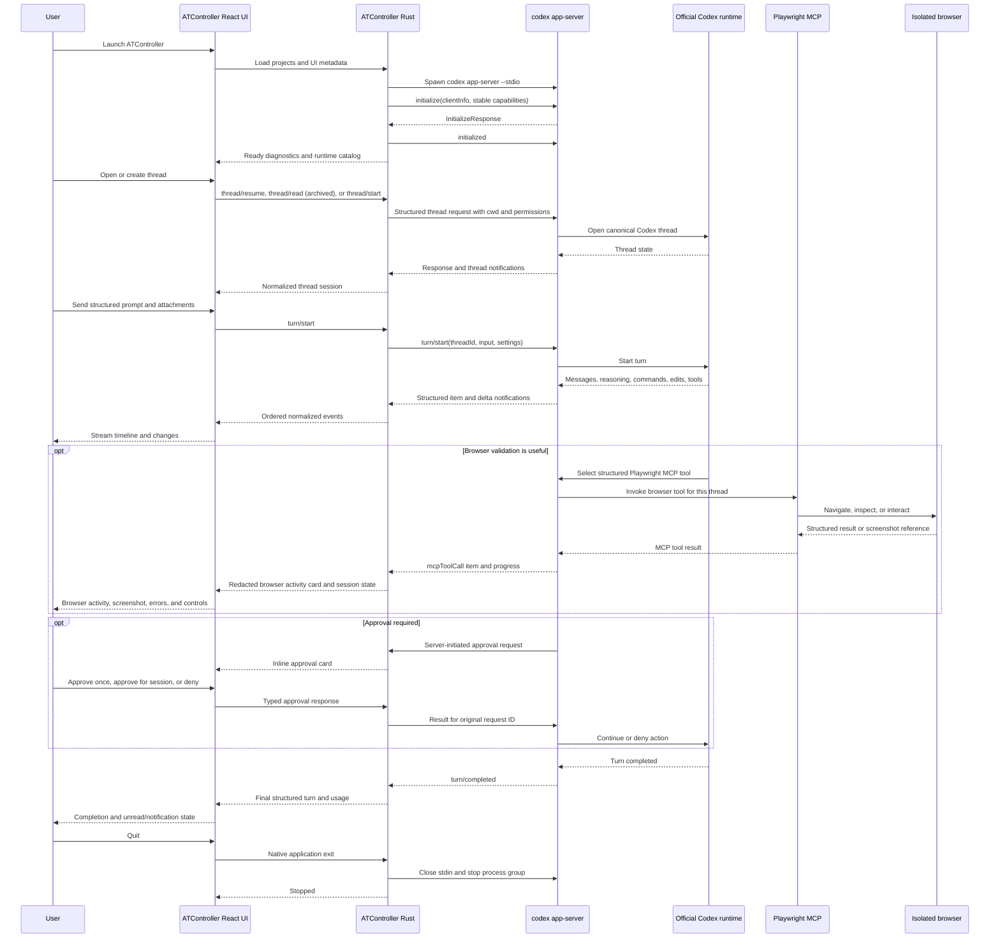

# ATController Technology

This document describes the production architecture of ATController.

## Fixed identity

- Product and displayed name: `ATController`
- macOS application bundle: `ATController.app`
- Bundle identifier: `com.furyanf.atcontroller`
- Release files: `ATController.dmg` and `ATController.app.zip`
- Application data: `~/Library/Application Support/ATController/`
- Runtime: the locally installed official Codex CLI

## System architecture

```text
React + TypeScript session UI
        ↕
Typed Tauri commands and bounded `codex:events` batches
        ↕
Rust ATController domain and supervision layer
        ↕
JSON RPC-style messages framed as JSONL over stdio
        ↕
codex app-server --stdio
        ↕
Official Codex runtime and Codex-owned thread history
```

React never owns the Codex child process. Rust never sends terminal keystrokes to operate a conversation. Standard session workflows use app-server methods and structured notifications.

Browser automation remains inside the structured Codex path:

```text
React browser menu, inspector, and timeline cards
        ↕ typed Tauri commands and `browser:state` events
Rust browser domain and cache manager
        ↕ stable app-server MCP requests and item notifications
codex app-server
        ↕ MCP transport owned by Codex
@playwright/mcp@0.0.77
        ↕
isolated headed Chrome/Chromium context
```

ATController does not spawn a browser from an arbitrary frontend command. Codex owns MCP process startup, routing, and tool execution. Rust validates the requested thread, workspace, URL, screenshot reference, and action before calling a fixed Playwright tool through app-server.

The optional Project Terminal follows a separate path:

```text
React xterm shelf
        ↕ typed terminal commands and bounded binary events
Rust native PTY manager
        ↕
User login shell in a registered project
```

This PTY is an explicit project utility. Its bytes never enter the Codex protocol parser or conversation reducer.

## Source map

### Frontend

- `src/App.tsx` coordinates projects, selected threads, persistence, Git refreshes, shortcuts, dialogs, and recovery.
- `src/stores/codexStore.ts` batches ordered protocol events and reduces them into stable thread, turn, item, approval, usage, and diagnostics views.
- `src/components/CodexSidebar.tsx` renders persistent, reorderable project shelves and nested running, recent, and archived thread groups.
- `src/components/ProjectContextMenu.tsx`, `ProjectImportDialog.tsx`, `CloneRepositoryDialog.tsx`, `ManageProjectsDialog.tsx`, and `ProjectIconDialog.tsx` implement project lifecycle surfaces.
- `src/components/ConversationTimeline.tsx` renders typed Codex items with progressive disclosure, safe GitHub-flavored Markdown, and preserved-scroll history paging.
- `src/components/BrowserMenu.tsx` exposes state-valid browser setup, lifecycle, screenshot, control-handoff, and diagnostics actions.
- `src/components/ProjectTerminalShelf.tsx` lazily loads xterm and renders the resizable built-in project utility terminal.
- `src/components/MessageComposer.tsx` serializes structured text, image, file, and skill input.
- `src/components/InspectorPanel.tsx` reconciles Codex activity with Git and runtime state.
- `src/components/ThreadContextMenu.tsx` and `CommandPalette.tsx` expose thread and keyboard-first actions.
- `src/components/ControlCenterDialog.tsx` owns settings and diagnostics surfaces.
- `src/lib/api.ts` is the single typed frontend wrapper around the Tauri boundary.

### Rust

- `src-tauri/src/codex/process.rs` discovers the executable, probes required capabilities, spawns the process, validates workspace paths, generates protocol snapshots, and controls process groups.
- `src-tauri/src/codex/transport.rs` owns bounded JSONL framing and keeps stdin, stdout, and stderr separate.
- `src-tauri/src/codex/rpc.rs` allocates IDs, correlates responses, handles notifications and server requests, applies timeouts and safe retries, and rejects pending work on exit.
- `src-tauri/src/codex/protocol.rs` normalizes generated wire values into the narrow ATController domain model.
- `src-tauri/src/codex/threads.rs` implements thread, turn, model, permission, attachment, and skill operations.
- `src-tauri/src/codex/resume.rs` probes and constructs external resume commands and performs Terminal.app handoff.
- `src-tauri/src/codex/diagnostics.rs` maintains bounded, redacted runtime diagnostics.
- `src-tauri/src/codex/mod.rs` supervises one connection and emits normalized events.
- `src-tauri/src/storage.rs` persists project and UI metadata and performs the app-server migration.
- `src-tauri/src/git_tools.rs` provides bounded Git inspection and safe mutations.
- `src-tauri/src/project_terminal.rs` validates project-scoped directories and owns native PTY process, input, resize, output, and shutdown lifecycles.
- `src-tauri/src/browser.rs` detects browser dependencies, manages the explicit MCP setup flow, routes fixed Playwright calls, owns per-thread browser metadata, bounds screenshots, and performs real browser self-tests.
- `src-tauri/src/main.rs` exposes the narrow Tauri command surface and native lifecycle hooks.

## Codex discovery and protocol generation

Discovery checks, in order:

1. the path stored in ATController settings;
2. `CODEX_CLI_PATH`;
3. the current process `PATH`;
4. common Homebrew and local installation paths;
5. the user login-shell environment.

Login-shell discovery uses a delimited marker so shell startup noise cannot be mistaken for the executable path.

`scripts/generate-codex-protocol.mjs`:

1. resolves the same configured or discoverable Codex binary;
2. records `codex --version`;
3. verifies both generation commands exist;
4. generates TypeScript into a temporary directory;
5. generates JSON Schema into a nested schema directory;
6. canonicalizes JSON output;
7. writes version metadata;
8. replaces `generated/codex-app-server/` only after successful generation.

`yarn codex:check-protocol` regenerates into a temporary directory and compares a deterministic tree digest. It fails when the installed runtime and checked-in protocol do not match.

Generated files are never manually mirrored into the frontend. Protocol-specific handling stays behind the Rust normalization layer.

## Process lifecycle

ATController starts exactly one normal runtime process with:

```text
<resolved-codex-binary> app-server --stdio
```

The executable and arguments are passed separately. The selected project is supplied through structured `cwd` request fields.

The supervised state machine is:

```text
Stopped → Starting → Initializing → Ready
                         │            │
                         └→ Failed    ├→ Degraded → Restarting → Ready
                                      └→ Stopping → Stopped
```

Automatic restart is bounded to two attempts. A connection that stays healthy for one minute resets the attempt counter. Explicit restart closes the old connection before spawning its replacement.

On application shutdown:

1. the connection stops accepting work;
2. the writer closes app-server stdin;
3. pending requests are rejected;
4. ATController waits briefly for normal exit;
5. the process group receives `SIGTERM`;
6. `SIGKILL` is used only if the process still has not exited.

The native application exit event and Unix `SIGTERM` both enter this path. Process-group signaling runs even when a version-manager shim reports exit before its descendants, preventing orphaned app-server processes.

Project Terminal sessions receive `SIGHUP` and a child kill request on stop or shutdown, followed by a bounded 350 ms grace period and process-group `SIGKILL` during application shutdown. This lifecycle is independent of app-server supervision.

## Transport and framing

The production transport is stdio:

```text
stdin   outbound protocol requests, notifications, and server-request responses
stdout  newline-delimited JSON protocol messages
stderr  bounded diagnostic and crash output
```

stdout and stderr never share a parser. The transport uses:

- a 256-message outbound channel;
- a 256-message inbound channel;
- a 256 MiB maximum JSONL frame, required because official full-history responses are a single line;
- a 16 KiB maximum stderr line;
- bounded enqueue timeouts and natural async backpressure.

Malformed or oversized messages are isolated to one frame and recorded as redacted protocol diagnostics. Parsing resumes at the next newline, and an oversized response rejects pending requests immediately with a compatibility error instead of waiting for their timeouts.

## Initialization

No normal request is accepted before initialization succeeds.

ATController sends:

```json
{
  "id": 1,
  "method": "initialize",
  "params": {
    "clientInfo": {
      "name": "atcontroller",
      "title": "ATController",
      "version": "<application-version>"
    },
    "capabilities": {
      "experimentalApi": false
    }
  }
}
```

After the successful response, ATController sends `initialized` once and marks the connection Ready. Reinitialization requires a new process and connection.

## RPC behavior

The wire protocol follows the generated Codex schema and may omit a `jsonrpc` field. ATController therefore does not inject one.

The client provides:

- monotonically increasing unsigned request IDs;
- concurrent response correlation through one-shot channels;
- duplicate and unknown response detection;
- server notifications without IDs;
- supported server requests with exact response shapes;
- operation-specific timeouts;
- automatic pending-request rejection on transport loss;
- clean late-response handling;
- unknown-notification tolerance;
- overload retry only for idempotent operations;
- exponential backoff with jitter and at most three attempts.

User turns, thread creation, rename, archive, deletion, steering, approvals, and other state-changing operations are never automatically replayed. A failed user turn is retried only through an explicit new action.

## Implemented methods

Stable request methods currently used include:

```text
model/list
permissionProfile/list
config/read
account/read
account/rateLimits/read
account/login/start
skills/list
config/mcpServer/reload
mcpServerStatus/list
mcpServer/tool/call

thread/list
thread/start
thread/read
thread/resume
thread/fork
thread/name/set
thread/archive
thread/unarchive
thread/delete

turn/start
turn/steer
turn/interrupt
```

Supported server requests include:

```text
item/commandExecution/requestApproval
item/fileChange/requestApproval
item/permissions/requestApproval
item/tool/requestUserInput
mcpServer/elicitation/request
execCommandApproval
applyPatchApproval
```

Unsupported future server requests receive a structured method-not-supported response instead of hanging.

## Normalized notifications

The normalizer recognizes thread lifecycle, turn lifecycle, item lifecycle, streamed agent text, streamed command output, reasoning summary and detail deltas, plan updates, file-change updates, token usage, account/rate-limit changes, thread settings, and server-request resolution.

Important recognized methods include:

```text
thread/started
thread/status/changed
thread/name/updated
thread/archived
thread/unarchived
thread/deleted
thread/settings/updated

turn/started
turn/completed
turn/plan/updated
turn/diff/updated

item/started
item/completed
item/agentMessage/delta
item/commandExecution/outputDelta
item/fileChange/outputDelta
item/fileChange/patchUpdated
item/reasoning/summaryPartAdded
item/reasoning/summaryTextDelta
item/reasoning/textDelta
item/plan/delta
item/mcpToolCall/progress

thread/tokenUsage/updated
account/updated
account/rateLimits/updated
account/login/completed
serverRequest/resolved
```

Unknown methods become generic structured events containing bounded details. They do not terminate the session.

Completed and in-progress `mcpToolCall` items are recognized as browser activity only when the actual structured server/tool metadata identifies the managed `atcontroller-playwright` server and a `browser_*` tool. The normalizer maps those calls into navigation, click, type, select, hover, scroll, upload, screenshot, page inspection, console, network, tab, and browser-error activities. It never scans agent prose for browser intent.

Before browser tool inputs or results cross into React, ATController:

- removes typed form values and other sensitive input fields;
- redacts credential-bearing keys and authorization/cookie lines;
- strips sensitive URL query values;
- bounds developer-detail JSON;
- derives compact console-error and failed-request summaries;
- accepts screenshot references only when they resolve beneath the managed cache.

## Domain model and state reduction

The frontend consumes six first-class concepts:

```text
Workspace
Codex Thread
Codex Turn
Codex Item
Approval Request
Runtime Process
```

An event sequence is assigned by the long-lived Rust runtime and remains monotonic across process restarts. Rust collects notifications for at most 8 ms, coalesces adjacent text/output deltas for the same item, and sends batches of at most 128 events across the WebKit bridge. React queues those events until the next animation frame, sorts by sequence, coalesces any remaining adjacent deltas, and reduces at most 128 events per frame. The queue uses a moving head with periodic compaction, avoiding repeated front-array copies during large bursts without dropping output.

Item events may arrive before the request response or before the turn payload. The reducer creates placeholders, appends deltas to only the matching item, and merges later authoritative objects. Repeated sequences and repeated item completion payloads are deduplicated.

Store slices retain their object identity when an event does not change them, so generic notifications do not wake thread, approval, or usage subscribers. A lightweight navigation projection changes only for thread metadata or lifecycle state, keeping the application shell and project shelves asleep during transcript streaming. Drafts use a per-thread external store, so typing rerenders only the active composer and persistence occurs after a short idle interval. Full-history hydration merges turns in one indexed pass rather than repeatedly cloning growing arrays, and unchanged list refreshes preserve existing thread references.

Completed turns are memoized and older blocks use CSS content visibility. Streaming output updates only the active item; Markdown parsing, command-output presentation, and inspector aggregation are deferred so they do not compete with input or pointer work. Opening or restoring a thread pins it to the latest turn through deferred layout changes; a content resize continues following only while the reader remains at the bottom. Scrolling upward cancels the pin and shows **Jump to latest** instead of forcing the viewport back down.

Live turn, queued-message, and streaming-caret indicators are intentionally static. Animating their shadows or opacity kept WebKit's rendering timer active for the entire duration of a turn and forced continuous style resolution, layer updates, and painting on long timelines.

Rendered live command output is capped at the latest 128,000 characters per item with an explicit truncation marker. During history normalization, command output, diffs, inline data, and verbose tool details receive per-item bounds before serialization across Tauri. High-frequency turn-diff notifications send only lifecycle metadata because Git is the inspector's source of truth. A long conversation initially mounts only its newest 24 turns and reveals earlier pages without moving the reader’s viewport. These constraints keep pathological histories from exhausting the WebView while Codex-owned history and the working tree remain authoritative.

## Permissions and approvals

The three UI modes map to generated protocol values:

| Mode | Thread sandbox | Turn sandbox policy | Approval policy |
| --- | --- | --- | --- |
| Standard | `read-only` | `readOnly` with network disabled | `on-request` |
| Workspace Access | `workspace-write` | `workspaceWrite` scoped to the project | `on-request` |
| Full Access | `danger-full-access` | `dangerFullAccess` | `never` |

Approval decisions are limited to values exposed by the installed protocol. Command and file requests support accept, accept-for-session, decline, and cancel where advertised. Permission requests return the requested structured permission subset or an empty subset. User-input answers preserve protocol question identifiers. MCP elicitation uses the generated action values.

Full Access is configured through protocol fields. It is never implemented by writing an approval answer into a terminal.

## Models and effective settings

`model/list` is the only source for model names, supported reasoning efforts, input modalities, service tiers, and Ultra availability.

ATController keeps:

- the user-requested model, effort, and tier in UI metadata;
- the runtime-reported effective values in the active thread session;
- a resolution label indicating applied, runtime default, or runtime fallback.

The UI never silently treats a fallback as the requested setting.

Reasoning-effort and permission changes are session boundaries. ATController persists
the requested values, interrupts an active turn through `turn/interrupt`, and then
rejoins the same canonical thread through `thread/resume`. Reasoning is carried in
the generated `config.model_reasoning_effort` field; approval and sandbox overrides
use the generated resume fields. The interrupted prompt is never submitted again
automatically.

## Attachments

Structured input conversion validates:

- non-empty text;
- supported inline image media types;
- a maximum estimated 10 MiB decoded inline image size;
- canonical local paths;
- whether a local file is inside the active project;
- explicit `allowOutsideWorkspace` for external paths;
- selected skill name/path against the runtime `skills/list` result.

The composer combines two authoritative catalogs for `@` autocomplete. Installed,
enabled plugin packs come from `plugin/list` and are sent as mention inputs with
canonical `plugin://<plugin-id>` paths. Repository skills from `skills/list` under
`.github/skills` or `.agents/skills` remain individual structured skill inputs.
Internal leaf skills from installed plugin packs are not flattened into the picker.
`skills/changed` invalidates the project-skill catalog without restarting the
runtime.

Binary files are not expanded into giant text prompts.

## Structured Markdown

Agent-message Markdown is parsed in React with `react-markdown` and `remark-gfm`. ATController does not enable raw HTML. Balanced structured `:::writing{...}` envelopes are removed before rendering while their Markdown body is retained. HTTP(S) links cross the typed URL-opening command, fenced code is rendered in bounded scroll regions with an explicit copy action, and Markdown images are represented as inert attachment labels rather than making remote requests. User prompts remain rendered as authored text.

## Project Terminal boundary

The Project Terminal Tauri surface exposes only start, list, write, resize, and stop operations. Starting requires a persisted workspace ID; both the project root and optional working directory are canonicalized, and the latter must be within the former. Shell executables must be absolute existing files. PTY dimensions, input messages, output chunks, and event queues are bounded.

Rust launches the login shell with an argument array and sets terminal capability environment values. Output travels as base64-encoded byte chunks so arbitrary terminal bytes do not pass through lossy JSON string conversion. The xterm dependency is lazy-loaded only when the shelf is first opened.

One shell session is retained per project while its shelf is hidden. Restart and stop are explicit. Every session is terminated during native application exit, and terminal output is never reduced into Codex items, diagnostics, or persisted transcripts.

## Persistence

Codex remains the source of truth for thread and turn history. ATController persists:

```text
workspaces.json
settings.json
codex-thread-ui.json
```

`codex-thread-ui.json` is keyed by canonical thread ID and contains only UI metadata:

- project association and fallback title
- pinned and unread state
- draft and bounded prompt history
- requested model, reasoning, and service tier
- permission mode
- last-viewed and update timestamps

Each `workspaces.json` project contains an ID, display name, canonical path, workspace type, creation and last-opened timestamps, pinned/custom-order/expanded state, icon preference, availability, and bounded Git preferences. Thread UI metadata points to exactly one project ID.

`browser-sessions.json` contains browser UI metadata only: thread/workspace association, ATController session identifier, last URL/title/page reference, panel/window visibility, control owner, last screenshot reference, counts, bounded recent activities, timestamps, and failure state. Browser cookies, credentials, passwords, headers, form contents, and profile data are not serialized.

Screenshots and Playwright text artifacts live under `browser-cache/playwright/`. Screenshot reads, reveal, and deletion require a safe relative path that resolves inside that directory. Startup cleanup bounds the cache to 256 MiB and 160 entries; individual screenshot reads are limited to 24 MiB.

The app-server v3 migration writes a backup before importing compatible metadata. Records without a canonical Codex identifier or with an incompatible runtime identity are reported and left untouched. The project-shelves v1 migration separately backs up flat workspace/UI state, canonicalizes paths, enriches project records, and preserves malformed or unavailable entries in its report. Migration writes use temporary files, fsync, and atomic rename.

Official unscoped `thread/list` discovery groups active and archived Codex threads by canonical `cwd`. Importing a discovered project persists only the workspace and UI association; transcripts are neither copied nor rewritten.

## Git boundary

All Git commands receive a canonical registered project path. File paths must resolve inside the repository root and outside `.git`. Branch names are validated and passed as individual process arguments. Output capture is bounded and drains stdout/stderr concurrently to avoid pipe deadlocks.

Branch switching refuses unsafe dirty states. File revert requires UI confirmation and refuses to silently delete untracked files.

## Security boundary

ATController is not a privilege boundary around Codex. Full Access gives Codex the rights of the current macOS user.

The application does provide integration hardening:

- restrictive WebView Content Security Policy;
- typed and narrow Tauri commands;
- canonical path allowlists;
- direct process spawning without shell command composition;
- no generic one-shot frontend shell execution; typed PTY input is limited to an explicitly opened, project-scoped Project Terminal session;
- bounded transport queues and diagnostic buffers;
- credential-pattern redaction;
- no ATController credential store;
- no prompt text in copied diagnostics;
- separate diagnostic stderr;
- exact external URL scheme validation.
- a pinned Playwright MCP package and explicit setup preview before Codex configuration is modified;
- isolated browser profiles and no connection to a personal Chrome profile by default;
- thread-scoped MCP routing and browser-session association;
- no global Chrome, Chromium, Node, or `npx` process matching or termination;
- browser shutdown through the exact thread-scoped Playwright MCP connection, followed by normal app-server process-group supervision.

## Sequence



## Test layers

- Rust unit tests cover framing, oversized recovery, redaction, permission mapping, protocol normalization, workspace validation, Git safety, Project Terminal constraints, migration, resume argument construction, and process behavior.
- Browser unit tests cover dependency/config parsing, setup safety, URL and screenshot validation, state transitions, activity association, sensitive-value redaction, console/network summaries, cache bounds, and thread isolation.
- Frontend tests cover event reduction, ordering, deduplication, sidebar sections, approvals, safe Markdown and structured timeline/browser cards, native and WebKit file drops, prompt history, browser setup/diagnostics/inspector controls, appearance, context menus, and keyboard behavior.
- Contract tests start the real installed app-server in a temporary Git repository and exercise initialization, account/model reads, thread lifecycle, a real streamed turn, archive/restore, and cleanup.
- The opt-in browser contract uses the real installed app-server and `@playwright/mcp@0.0.77`: it starts two temporary thread/browser sessions and local pages, proves isolation, fills and submits a form, observes a console error and HTTP 500, stores a managed screenshot, runs a real Codex browser turn, verifies typed `mcpToolCall` normalization, closes both sessions, and asserts that the app-server/MCP process group exited.
- End-to-end runtime tests create and modify a real temporary file, verify structured activity and Git state, restart the process, resume the same thread, interrupt a turn, exercise Standard approval denial and Full Access, handle invalid IDs, and verify no orphan process remains.

## Release architecture

Local production-shaped packages are native Apple silicon only. `scripts/package-local-macos.sh`:

1. builds `ATController.app`;
2. verifies the executable is `arm64`;
3. verifies bundle name and identifier;
4. applies and verifies an ad-hoc local signature;
5. creates and verifies `ATController.dmg`;
6. creates and verifies `ATController.app.zip`.

Tagged GitHub Actions releases import a Developer ID certificate, sign, notarize, staple, verify Gatekeeper acceptance, and publish exactly the two production artifact names.
